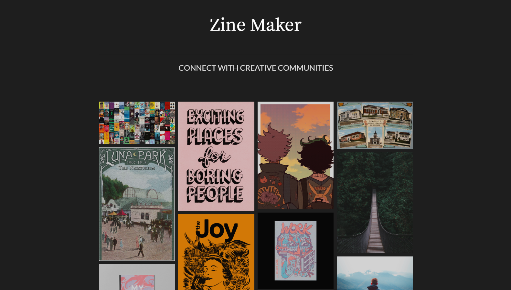

# Zine Maker (C# ASP .NET Application)

## By _**Krista Rutz & Andriy Veremyeyev**_

#### Stay connected with your communities by making shared digital publications about any topic you desire. Hosted on [GitHub](https://github.com/ZineMaker/ZineClient.Solution). _Last Updated 04.10.2020._

---

## Table of Contents

- 1. [Description](#description)
- 2. [Setup/Installation Requirements](#installation--set-up)
- 3. [Specifications](#specs)
  - [The Back End](<#The-Back-End-(1)-MODELS-AND-SCHEMA-DATA>)
    - 1. [MODELS AND SCHEMA DATA](<#The-Back-End-(1)-MODELS-AND-SCHEMA-DATA>)
  - [The Front End: THE VIEWABLE SITE](#The-Front-End-THE-VIEWABLE-SITE)
    - 2. [IDENTITY AUTHENTICATION](<#(2)-IDENTITY-AUTHENTICATION>)
    - 3. [USER EXPERIENCE AND INTERFACE OVERVIEW](<#(3)-USER-EXPERIENCE-AND-INTERFACE-OVERVIEW>)
    - 4. [SITE STRUCTURE](<#(4)-SITE-STRUCTURE>)
- 4. [Technologies Used](#technologies-used)
  - [Portfolio Skills](#epicodus-skills)
- 5. [Known Bugs](#known-bugs)
- 6. [The Future of Zine Maker?](#projected-goals)
- 7. [Support & Contact](#support-and-contact-details)
- 8. [License & Usage](#license)

---

## Description

Make some digital zines!

In the time of pandemic and social isolation, it's more important than ever to stay safely connected to each other and to find healthy ways to express ourselves. Enter _Zine Maker_.

Similar to a blog or a digital magazine, use Zine Maker to create content-rich posts and organize them into readable publications. Sign up for an account, join community organizations or create your own, and then get started by submitting your posts to e-zines that you or your organization maintains.

- Registered users can add content and edit it freely.
- Curate collections of content (aka Zines) for viewing on a website with intuitive UX and beautiful, modern UI.
- Add tags to your posts, and then search for curated content based on these tags.
- Mobile-friendly responsive design keeps site readable for smart-phone and desktop users alike.

  
Photos of Responsive Zine

_This project was developed in C# on the .NET Core platform with ASP.NET Core web processing, using MVC pattern libraries, Razor dynamic templating, and a SQL database. Specifically, the app was built using Entity Framework and MySQL to create the schema, and it's hosted on [GitHub](https://github.com/ZineMaker/ZineClient.Solution)._

## Installation / Set-up

Download or clone the repository to serve this program locally!

_This program requires .NET Core SDK to run. [Here is a free tutorial](https://www.learnhowtoprogram.com/c-and-net/getting-started-with-c/installing-c-and-net) for installing .NET on Mac or Windows 10._

_This program also makes use of SQL databases. We recommend using MySQL Workbench to build your databases. [Here is a free tutorial](https://www.learnhowtoprogram.com/c-and-net/getting-started-with-c/installing-and-configuring-mysql) for installing MySQL WorkBench and MySQL Community Server on Mac or Windows 10._

- 1. Download or clone this repo.
  - **To Download ZIP:**
    - Select "Download" on the [GitHub Repository](https://github.com/ZineMaker/ZineClient.Solution) site
    - Once downloaded, open the ZIP and extract files. The new folder will be created as 'ZineClient.Solution'.
  - **To Clone:**
    - Clone from command line into your Desktop: \$ `git clone https://github.com/ZineMaker/ZineClient.Solution`
    - The new directory will be created as 'Desktop/ZineClient.Solution'.
- 2. Once you have stored the files locally, execute the following commands.
  - Navigate to the application directory: \$ `cd Desktop/ZineClient.Solution/ZineClient`
  - \$ `dotnet restore`
  - \$ `dotnet ef database update`
  - \$ `dotnet build`
  - \$ `dotnet run`
- 3. Upon success, the program will begin running in your console.

## Specs

Here are the features of the site that we aimed to include, with intended functionality.

### The Back End: (1) MODELS AND SCHEMA DATA

  
Expand for details

- The ZineClient will organize the data into classes, as follows:
  - All classes have unique IDs for reference
  - **Users** contain information about username, first name, last name, email, hashed password, authored posts, organizational memberships, GUID
  - **Organizations** contain a name, description, owner (a user), list of members, logo image, list of zines
  - **Zines** contain a name, issue number, description, cover image, list of posts, owner (an organization), publication date
  - **Posts** contain a title, source, timestamp, main image, the content body, the authoring user, a list of zines to which the post has been submitted, a list of tags
  - **Tags** contain a list of associated posts, name descriptor
  - _Notes:_ Each zine exists only one time, and can have only one maintaining organization. However, posts can be submitted to multiple zines and it does not repeat the existence of the post. Tags can also be re-used. A member user can join any number of organizations.

### The Front End: THE VIEWABLE SITE

#### (2) IDENTITY AUTHENTICATION

  
Expand for details

- The application should have user authentication.

- A user should be able to register. Data validations will ensure proper registration credentials are used.
- A user should be able to log in and log out.
- Only logged in users should have create, update and delete functionality.
- Both anonymous and logged in users should be able to have read functionality.
- Users should be able to see their own contributions in a specified area of the site.
- Logged-in users will have access to buttons for adding, editing, and deleting content, including Organizations, Zines, Posts, and Tags.

Register Screen

Log In Screen

#### (3) USER EXPERIENCE AND INTERFACE OVERVIEW

  
Expand for details

- The site should be as intuitive and user-friendly as possible. Buttons should be where you expect to find them, every page should have several logical links to other pages within the site, and everything should be clearly labeled.

- Each page should be visually appealing and organized without being cluttered. Each different action will have its own view.
- Each page should reflect a standardized design that implements reuable Bootstrap and customized CSS classes to create a cohesive, modern aesthetic.

#### (4) SITE STRUCTURE

  
Expand for details

- **Home Page:** A user should be able to navigate to a splash page with links to rest of site.
- **Navigation Bar** contains links to the home page, the public indices, and the account section dropdown. If not logged in, the account section shows options to log in or register. Otherwise, it shows the account index, private orgs and posts, and the log out button. 
- **Indices**:
  - _Organizations_ shows all organizations (with name, logo image, and description) in a list
  - _My organizations_ shows all of the logged-in user's organizations (with name, logo image, and description) in a list 
  - _Zines_ shows all publications (with name and cover image) in an image gallery 
  - _Posts_ shows all posts (with title, main image, and content preview) in a list 
  - _My posts_ shows all of the logged-in user's posts (with title, main image, and content preview) in a list 
  - _Tags_ shows all of the tags that have been added to the site listed in a text block 
  - _Account_ shows the basic account information
- **Details Pages**
  - Users should be able to click on an individual zine to read it, which all of the zines' content and full posts on the page.
  - Users should be able to click an individual post's title to view it, including all content, all zines where it was published, and all tags.
  - Organizations have unique pages which display a gallery of Zine covers and a list of members 
  - Tag detail pages aggregate all posts that share a tag 
- **Create, Edit, and Delete Pages**

  - Using forms, the user can create new accounts, organizations, posts, zines, and tags  
  - Using forms, the user can edit or delete organizations, zines, and posts
  - Using Quill.Js, the user can write, edit, and read posts with Rich-Text formatting retained.
  - Users can "join" (be added to list of members of) an organization
  - Posts can be added to or removed from zines
  - Tags can be added to or removed from posts

## Technologies Used

- ASP .NET Core with Microsoft's .NET Core 2.2
  - C# Back-end
  - Server-side in C#, client-side in JavaScript
  - HTML, CSS, and C# Razor templating
- MySQL database, Entity Framework integration
- Git
- GitHub
- Additional pen source projects:
  - Bootstrap
  - jQuery
  - Quill.js
- Developed with Visual Studio Code

#### Epicodus skills:

This project codebase was created for the Epicodus week 14 team week project, on week 7 of the C# and .NET course. It demonstrates several key full-stack development skills.

- C# and SQL back-end
- C#, HTML, CSS, and JavaScript front-end
- Bootstrap library
- Razor view on pages
- MVC pattern (with ASP .NET Core 2.2)
- RESTful routing and CRUD
- User-editable and interactive content maintained in SQL database
- Many-to-many and many-to-one class relationships
- Entity framework migrations
- Identity and authorization
- Asynchronous code
- MySQL Workbench and server
- Bootstrap library
- Behavior driven development (BDD)
- Git version control and GitHub
- Pair programming in Visual Studio Code LiveShare

## Known Bugs

- No known bugs
- Current functionality does not assign user roles, so all registered and logged-in users have equal create, edit, and delete functionality regardless of initial contribution level.

## Projected Goals

Where do we see this project going? Hopefully straight into your daily routine. Here are some of our current goals for the project, and features we hope to see in the future!

- [ ] Deploy it!
- [ ] Uploading pictures to the database - currently only accepts URLs
- [ ] Search bar functionality
- [ ] Embedding content
  - Tweets
  - Videos
- [ ] Improved user-customizable format for zines
- [ ] Authentication and roles: deep dive
  - [ ] Set roles for admins, owners of zines, organizations, etc
  - [ ] Limit write-access based on user preferences (Only the creator of an organization or post should be able to edit/delete it)
  - Ability to delete account, edit account, and leave organizations
- [ ] Build an API so devs can retrieve posts or zines to use in future projects!

## Support and Contact Details

Please contact Krista or Andriy if you run into any issues or have questions, ideas or concerns. They can be contacted at <krista.rutz@pomona.edu> and <belyybrat@gmail.com>. Feel free to create a pull request for updates - _contributions to the code are encouraged!_

## License

Copyright (c) 2020 **_Krista Rutz and Andriy Veremyeyev_**

_This software is licensed under [the MIT license](./LICENSE)._
